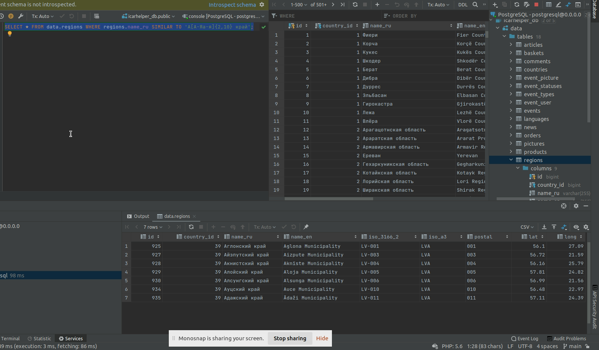
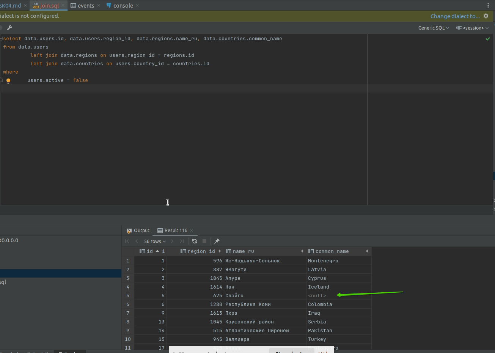
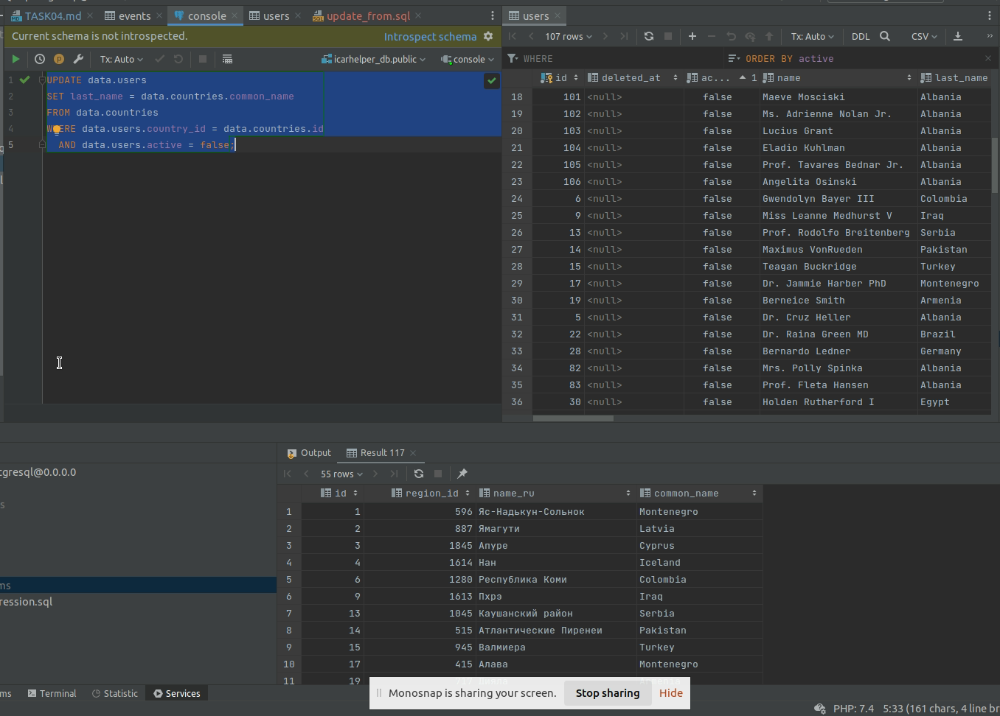

## Task 4

### Схема
[Ссылка на sqldbm (требуется авторизация)](https://app.sqldbm.com/MySQL/Edit/p195366/)
##### Логин: "wgw64138@boofx.com"
##### Пароль: "sdfLK359sdj"

---

### Наполнение БД обязательными данными

[код наполнения БД обязательными данными](https://github.com/PanovAlexey/database_course/blob/main/docs/tasks/04/insert_seeding_data.sql)

---

### Наполнение БД тестовыми данными

[код наполнения БД тестовыми данными](https://github.com/PanovAlexey/database_course/blob/main/docs/tasks/04/insert_mock_data.sql)

---

### Запрос с использованием регулярного выражения

Производится поиск административно-территориальных единиц "край", название которых начинается на "А" 
и с ограничением по длине с использованием регулярного выражения.

[код запроса с использованием регулярного выражения](https://github.com/PanovAlexey/database_course/blob/main/docs/tasks/04/regular_expression.sql)

Пример результата выполнения:

---

### Запрос с использованием LEFT JOIN и INNER JOIN

[код запроса с использованием LEFT JOIN и INNER JOIN](https://github.com/PanovAlexey/database_course/blob/main/docs/tasks/04/join.sql)

При использовании _left join_ выводятся, в том числе пользователи, для которых не удалось получить информацию
о стране. Значение равняется _null_. 

При замене _left join_ на _inner join_ выводятся только записи, для которых удалось найти совпадение
во всех таблицах.

---

### Запрос с использованием UPDATE FROM

Изменение фамилии у неактивных пользователей на название страны, которой соответствует их профиль.

[код запроса с использованием UPDATE FROM](https://github.com/PanovAlexey/database_course/blob/main/docs/tasks/04/update_from.sql)

[На главную](https://github.com/PanovAlexey/database_course/blob/main/README.md)