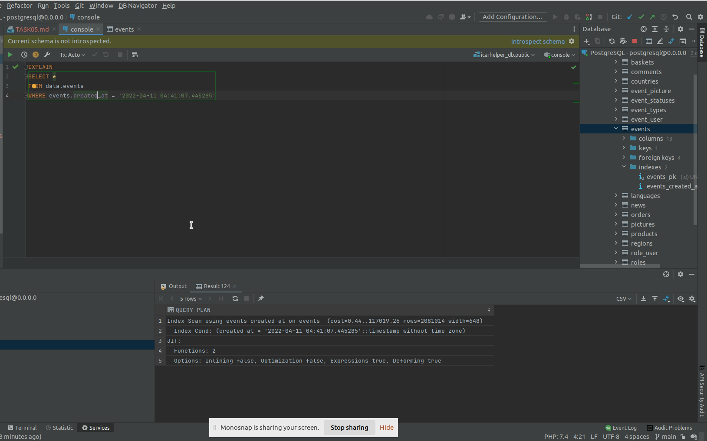

## Task 5

### Схема
[Ссылка на sqldbm (требуется авторизация)](https://app.sqldbm.com/MySQL/Edit/p195366/)
##### Логин: "wgw64138@boofx.com"
##### Пароль: "sdfLK359sdj"

---

### Создание индексов

Для возможности последующего анализа индекса предварительно необходимо заполнить таблицу большим количеством данных.

[код заполнения таблицы событий случайными данными](https://github.com/PanovAlexey/database_course/blob/main/docs/tasks/05/fill_event_table.sql)

При запросе на чтение с использованием фильтрации по _created_at_ запланировано использование _sequence scan_ и ожидается,
что будет прочитано _20099940_ строк.

Теперь будет создан индекс по полю _created_at_ и выполнена команда _VACUUM (VERBOSE, ANALYZE)_.

[код создания индексов](https://github.com/PanovAlexey/database_course/blob/main/docs/tasks/05/create_indexes.sql)

---

### Результаты использования индексов

Повторный запрос на чтение уже будет использовать индекс:
_Index Only Scan_ для получения только проиндексированного поля:

>Index Only Scan using events_created_at on events  (cost=0.44..472187.32 rows=20099940 width=8)
Index Cond: ((created_at > '2020-09-29 11:32:41'::timestamp without time zone) AND (created_at < '2023-04-01 13:16:39'::timestamp without time zone))

и _Index Scan using_ для запроса на чтение всех полей с фильтрацией по проиндексированному полю _created_at_:

>Index Scan using events_created_at on events  (cost=0.44..117019.26 rows=2081014 width=648)
Index Cond: (created_at = '2022-04-11 04:41:07.445285'::timestamp without time zone)

---

[На главную](https://github.com/PanovAlexey/database_course/blob/main/README.md)