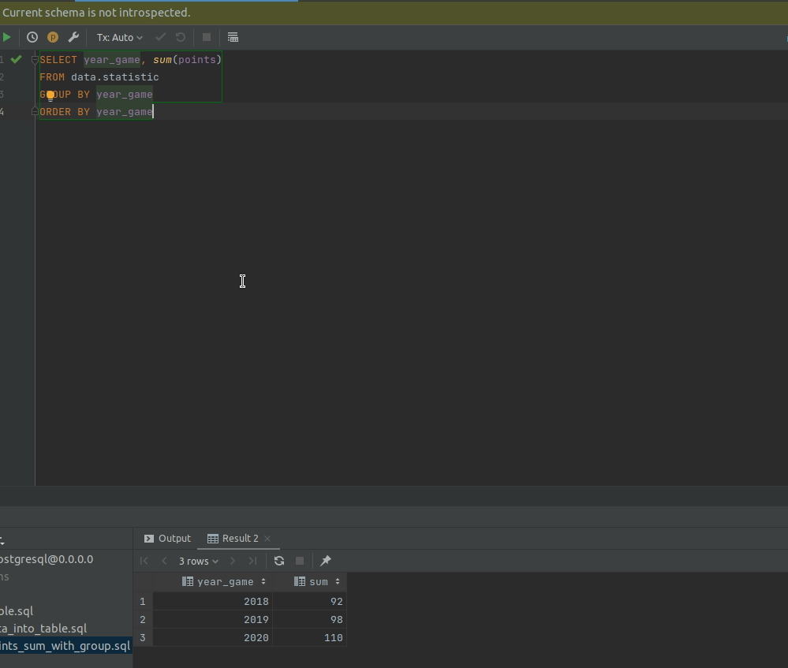
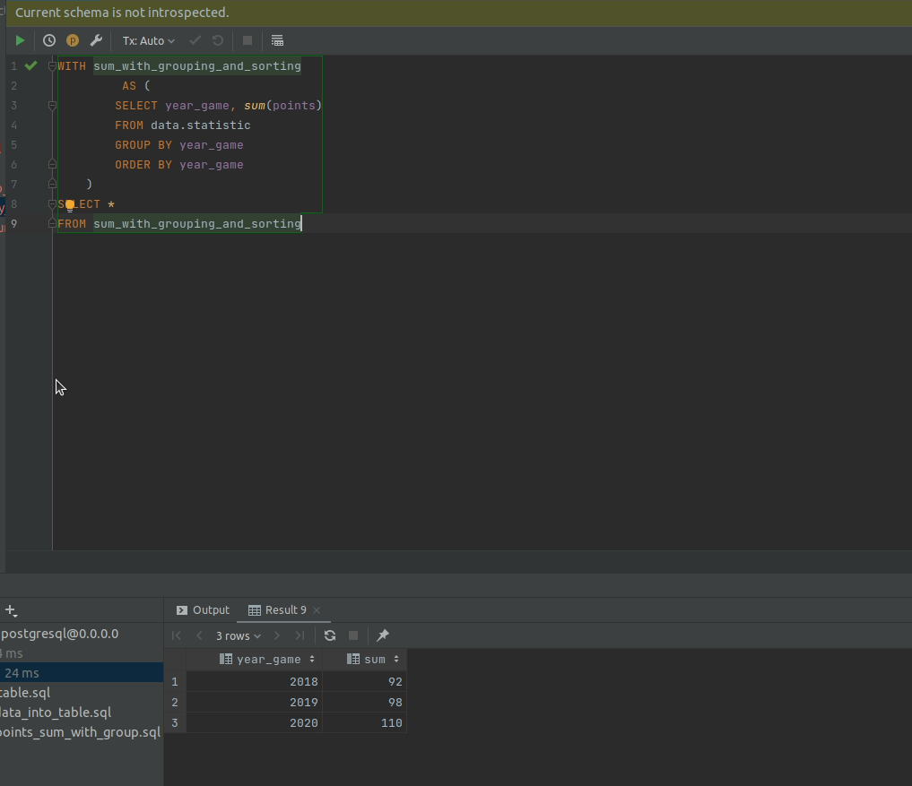

## Task 6

### Подготовка таблицы 

Для написания запросов с группировкой и использованием CTE необходимо предварительно создать таблицу и подготовить
данные.

[код создания таблицы](https://github.com/PanovAlexey/database_course/blob/main/docs/tasks/06/create_table.sql)
[код наполнения таблицы](https://github.com/PanovAlexey/database_course/blob/main/docs/tasks/06/insert_data_into_table.sql)

---

### Получение суммы очков с группировкой и сортировкой по годам

[код получения суммы очков с группировкой и сортировкой](https://github.com/PanovAlexey/database_course/blob/main/docs/tasks/06/select_points_sum_with_group.sql)

Результат выполнения данного кода выглядит так:

---

### Получение суммы очков с помощью CTE

[код получения суммы очков с помощью CTE](https://github.com/PanovAlexey/database_course/blob/main/docs/tasks/06/select_points_by_cte.sql)

Результат выполнения данного кода выглядит так:

Что полностью совпадает с результатом, достигнутым на прошлом шаге без использования CTE.

---
 

[На главную](https://github.com/PanovAlexey/database_course/blob/main/README.md)