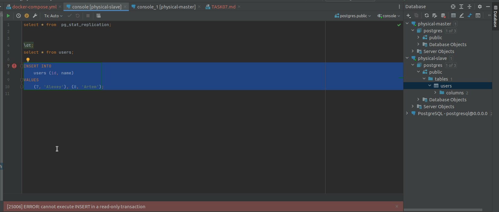

## Task 6

## Физическая репликация

### Настройка master-ноды 
```
cat >> ${PGDATA}/postgresql.conf <<EOF
wal_level = hot_standby
archive_mode = on
archive_command = 'cd .'
max_wal_senders = 4
wal_keep_size = 128
hot_standby = on
EOF
```

### Основная опция в настройках slave-ноды
```
hot_standby = on
```

### Результат репликации
Команда 
> select * from  pg_stat_replication;
на master-ноде приводит к выдаче следующего результата:
```
+---+--------+----------------+----------------+-----------+---------------+-----------+---------------------------------+------------+---------+---------+---------+---------+----------+---------+---------+----------+-------------+----------+---------------------------------+
|pid|usesysid|usename         |application_name|client_addr|client_hostname|client_port|backend_start                    |backend_xmin|state    |sent_lsn |write_lsn|flush_lsn|replay_lsn|write_lag|flush_lag|replay_lag|sync_priority|sync_state|reply_time                       |
+---+--------+----------------+----------------+-----------+---------------+-----------+---------------------------------+------------+---------+---------+---------+---------+----------+---------+---------+----------+-------------+----------+---------------------------------+
|77 |16384   |slave_user_login|walreceiver     |172.20.0.3 |NULL           |48502      |2022-05-18 19:19:04.927281 +00:00|NULL        |streaming|0/3000148|0/3000148|0/3000148|0/3000148 |NULL     |NULL     |NULL      |0            |async     |2022-05-18 19:25:00.010009 +00:00|
+---+--------+----------------+----------------+-----------+---------------+-----------+---------------------------------+------------+---------+---------+---------+---------+----------+---------+---------+----------+-------------+----------+---------------------------------+

```

При внесении новых данных или изменении существующих информация сразу же применяется и на 
slave-ноде.

При попытке добавить новые или изменить старые данные на slave возникает ошибка:



---

## Логическая репликация

### Настройка master-ноды
```
cat >> ${PGDATA}/postgresql.conf <<EOF
wal_level = hot_standby
archive_mode = on
archive_command = 'cd .'
max_wal_senders = 4
wal_keep_size = 128
hot_standby = on
EOF
```

### Настройка slave-ноды
```
psql -v ON_ERROR_STOP=1 --username "$POSTGRES_USER" --dbname "$POSTGRES_DB" <<-EOSQL
    create table test (id int);
    create subscription test_subscription
    connection 'host=$PG_MASTER_HOST port=$PG_MASTER_PORT user=$PG_MASTER_USER password=$PG_MASTER_PASSWORD dbname=$PG_MASTER_DB'
    publication people_publication with (copy_data = false);
EOSQL
```

### Основные отличия логической репликации от физической
- Данные, появившиеся на master-ноде до создания slave-ноды не копируются на slave.
- В slave-ноду тоже доступна запись новых данных, как и изменение уже имеющихся.
- Как следствие, нет гарантий полного совпадения данных внутри нод.

---


[На главную](https://github.com/PanovAlexey/database_course/blob/main/README.md)